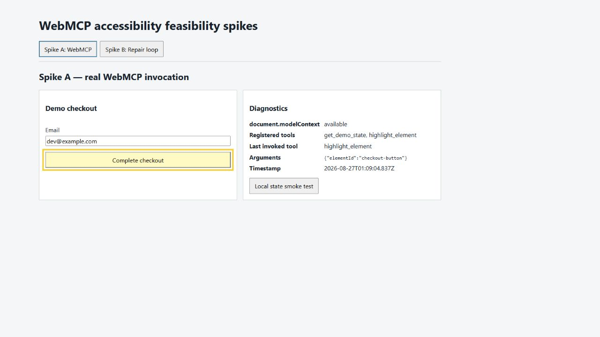
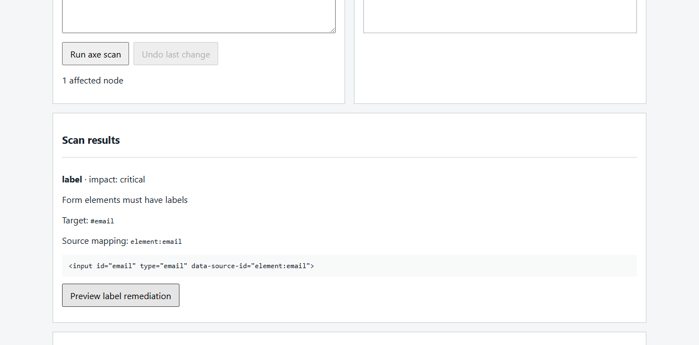
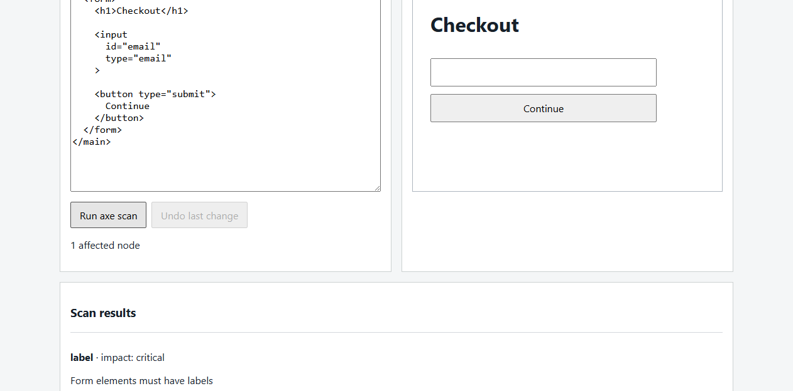

# Technical feasibility spike report

Test date: August 26, 2026 (PT)

> Historical scope: this report records the August 26 feasibility spikes. Its temporary deployment, two spike-only WebMCP tools, ID-based mapping, and one repair family were accurate for that test and are superseded by the current product requirements, implementation plan, and M7 report. Do not use those spike limitations as current release status.

## Result

- **SPIKE A: PASS**
- **SPIKE B: PASS**
- **Recommendation: PROCEED**

The two riskiest mechanics were proven independently: a browser agent invoked page-defined WebMCP tools that changed visible React state, and a deterministic accessibility repair removed an axe-core violation, survived a rescan, and could be undone exactly.

## 1. WebMCP documentation and implementation

Implementation followed the current [Chrome WebMCP Imperative API documentation](https://developer.chrome.com/docs/ai/webmcp/imperative-api), last updated August 20, 2026, and the [WebMCP draft specification](https://github.com/webmachinelearning/webmcp/blob/main/index.bs) as retrieved August 26, 2026.

The implemented API is:

- `document.modelContext.registerTool()`
- `document.modelContext.getTools()` / browser-mediated discovery
- `document.modelContext.executeTool()` / browser-mediated execution
- `AbortSignal` registration cleanup
- `annotations.readOnlyHint`
- `annotations.untrustedContentHint`

Chrome's documentation now marks `navigator.modelContext` deprecated in Chrome 150; this spike does not use it. TypeScript definitions are from `webmcp-types@0.1.5`.

Browser implementation tested:

- ChatGPT/Codex in-app browser on August 26, 2026
- Google Chrome `151.0.7922.174`
- Chrome feature: `--enable-features=WebMCP`
- `chrome-devtools-mcp@1.8.0`, with `--categoryExperimentalWebmcp=true`
- `@modelcontextprotocol/sdk@1.30.0` as the reproducible smoke-test client

An official OpenAI documentation search did not surface a dedicated public WebMCP API reference. The [OpenAI Developers showcase](https://developers.openai.com/showcase?view=webmcp-apps) said WebMCP examples were coming soon at test time. Chrome's current documentation and implementation were therefore used as the API authority, while ChatGPT's in-app browser was tested directly as a client.

## 2. WebMCP tools implemented

| Tool | Input | Annotation | Behavior |
| --- | --- | --- | --- |
| `get_demo_state` | Empty object; additional properties rejected | `readOnlyHint: true`, `untrustedContentHint: false` | Returns selected element, visible state, and the fixed list of demo element IDs. It also records invocation metadata for the visible diagnostic trail. |
| `highlight_element` | `{ "elementId": "email-field" | "checkout-button" }`; required; additional properties rejected | `readOnlyHint: false`, `untrustedContentHint: false` | Validates against known IDs and updates the shared React-visible store. |

There is no generic JavaScript, DOM mutation, source rewrite, network, shell, or system tool.

## 3. Deployment

Tested HTTPS URL:

<https://temporary-rapid-sirocco-f6mzi0x.vercel.app>

The Vercel CLI was logged out, so this is an anonymous temporary deployment. It was `READY` and passed the full remote WebMCP smoke test, but expires August 26, 2026 at 7:06:33 PM PT. A durable acceptance URL requires an authenticated redeploy; this is a hosting-credential limitation, not an application failure.

## 4. Browsers and clients tested

| Client | Result |
| --- | --- |
| ChatGPT/Codex in-app browser | Discovered both page tools, called both, and observed the visible React highlight and diagnostics. |
| Chrome 151 + Chrome DevTools MCP 1.8.0 | Listed both WebMCP tools, executed both against HTTPS, reloaded, rediscovered both tools, and found no console errors. |
| Headless Chrome 151 via `agent-browser` | Exercised the full manual Spike B scan/preview/apply/rescan/undo path. |

## 5. Manual prompt

Exact manual test prompt:

> Use the tools exposed by this page to highlight the checkout button.

The equivalent reproducible direct-agent test is:

```bash
npm run test:webmcp -- https://temporary-rapid-sirocco-f6mzi0x.vercel.app
```

## 6. Spike A acceptance criteria

| Criterion | Result | Evidence |
| --- | --- | --- |
| A. Real HTTPS deployment | **PASS** | Vercel returned `READY`; temporary URL above. |
| B. Tools discoverable in a compatible client | **PASS** | ChatGPT in-app browser and Chrome DevTools MCP both listed `get_demo_state` and `highlight_element`. |
| C. Agent calls `get_demo_state` | **PASS** | Returned no selection plus `email-field` and `checkout-button`. |
| D. Agent calls `highlight_element` | **PASS** | Returned `checkout-button is highlighted`. |
| E. Tool call changes visible React state | **PASS** | `#checkout-button` had class `highlighted`; no direct DOM mutation is used. |
| F. Diagnostics prove invocation | **PASS** | Panel showed tool name, `{ "elementId": "checkout-button" }`, and timestamp. |
| G. Reload remains functional | **PASS** | Remote smoke test reloaded the page and rediscovered both tools. |
| H. No registration console errors | **PASS** | Chrome DevTools MCP reported `<no console messages found>` for error-level messages after reload. |



## 7. Spike B acceptance criteria

| Requirement | Result | Evidence |
| --- | --- | --- |
| Editable source state | **PASS** | Controlled textarea holds the exact working HTML string. |
| Isolated preview | **PASS** | Sandboxed `srcDoc` iframe; editable scripts, embedded frames, objects, and inline event handlers are removed. |
| axe-core scan | **PASS** | Displays rule ID, impact, help text, target, source mapping, and relevant HTML. |
| Source mapping | **PASS** | `#email` maps to `element:email`. |
| Deterministic missing-label repair | **PASS** | Inserts one explicit label before the matched source input without reserializing the source. |
| Preview before commit | **PASS** | Shows before source, proposed source, rendered proposal, Apply, and Reject. |
| Apply | **PASS** | Commits proposed source to the controlled editor. |
| Rescan | **PASS** | Original `label` violation falls from one affected node to zero. |
| Undo and rescan | **PASS** | Restores the exact saved source; the original violation returns. |





## 8. Source-mapping technique

The preview parser adds `data-source-id="element:<html-id>"` to rendered elements that already have stable HTML IDs. After axe reports a selector such as `#email`, the scanner resolves that rendered node and reads its injected source ID. The working source itself is never modified by mapping metadata.

Tradeoff: this is deterministic and easy to inspect for the fixture, but it is not a universal source map. Duplicate or absent IDs, templating syntax, JSX, and parser normalization require a real AST with source ranges in the product phase.

## 9. Accessibility repair technique

The only repair family is **missing input label**. The transform:

1. accepts only axe rule `label` with a mapped `element:<id>`;
2. escapes and matches that exact input ID;
3. rejects a stale issue or an existing label;
4. derives `Email address` deterministically for an email input;
5. inserts one `<label for="email">Email address</label>` immediately before the unchanged input text.

No LLM or whole-document rewrite is involved. Undo stores the exact pre-apply string.

## 10. axe-core result before repair

- `axe-core@4.13.0`
- Rule: `label`
- Impact: `critical`
- Target: `#email`
- Affected nodes: `1`
- Message: `Form elements must have labels`
- Mapped source ID: `element:email`

## 11. axe-core result after repair

- Affected nodes: `0`
- The original `label` violation is absent for `#email`.
- After Undo and rescan: `label`, `critical`, `#email`, one affected node again.

## 12. Known limitations

- The deployed URL is temporary because no authenticated hosting session was available.
- WebMCP remains experimental and feature-gated; the exact browser surface may change before or after judging.
- Source mapping supports existing unique HTML IDs only.
- Exactly one remediation family exists by design.
- The iframe filtering/CSP is appropriate for this trusted static fixture, not a production untrusted-code sandbox. A full product needs a separately originated preview plus a reviewed sanitizer/parser boundary.
- The main bundle is about 224 kB gzip, mostly axe-core; code splitting was skipped for the spike.
- Spike B was intentionally not exposed through WebMCP. Spike A already proved the browser/React bridge, and manual Spike B was completed before stopping.

## 13. Unexpected behavior

1. `axe-core@4.13.0` treated the original placeholder-only email input as passing the `label` rule. The placeholder was removed from the deterministic broken fixture so the required missing-label failure is stable. The added explicit label remains the intended remediation.
2. Running parent-realm axe against an iframe root returned no useful cross-realm violations. axe-core now runs inside the preview realm; a nonce-restricted CSP allows only the bundled axe script.
3. ChatGPT's in-app browser emitted a tool-list update after the first registration before the second sequential registration completed. Waiting for the tool-change notification produced the complete list.
4. Chrome's current docs use `document.modelContext`; older `navigator.modelContext` examples are stale for this target.

## 14. Verification commands and logs

```bash
npm test
npm run build
npm run test:webmcp -- https://temporary-rapid-sirocco-f6mzi0x.vercel.app
```

Observed remote agent results:

- discovered both tool names and schemas;
- `get_demo_state`: `Completed`;
- `highlight_element`: `Completed`;
- visible `highlighted: true`;
- diagnostics contained `highlight_element` and the exact input;
- both tools rediscovered after reload;
- error-level console log: `<no console messages found>`.

## 15. GO / NO-GO

**GO — PROCEED**, with the full product gated on a durable deployment and a production-grade source/preview isolation design.

Top three technical risks:

1. WebMCP API/client availability and version drift while the standard remains experimental.
2. General source mapping and surgical edits beyond stable-ID static HTML.
3. Safely rendering genuinely untrusted imported HTML/CSS without weakening the browser isolation boundary.

Stop condition honored: no additional remediation types, backend, auth, database, framework integration, or full product workflow were built.
