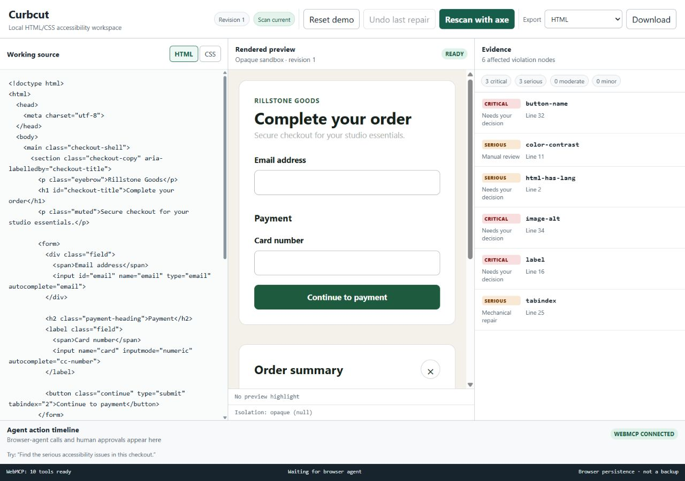
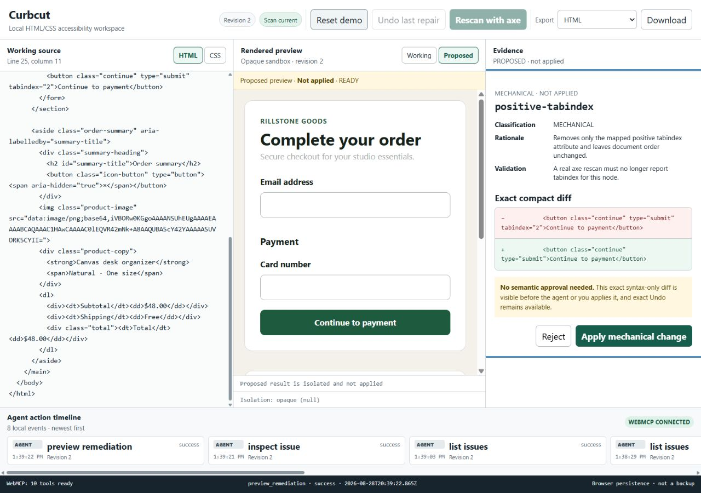
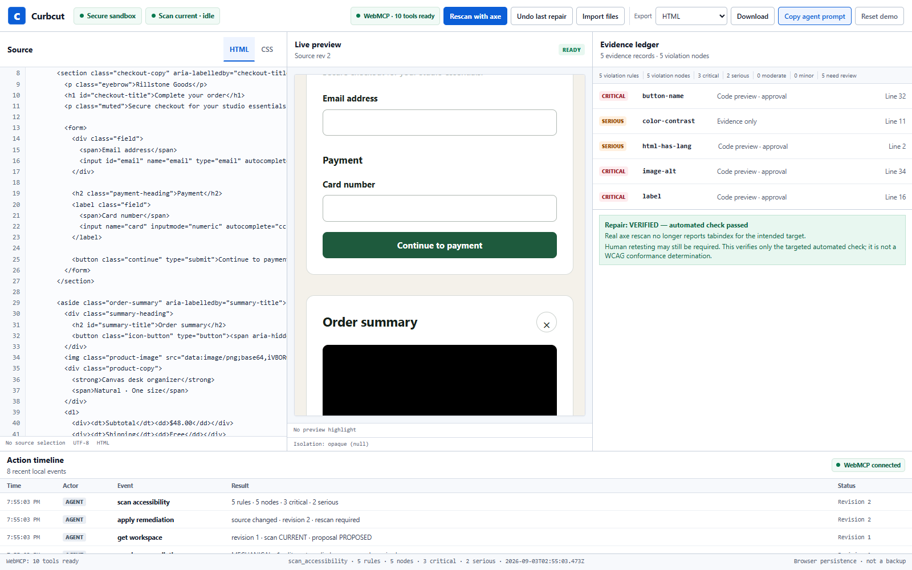
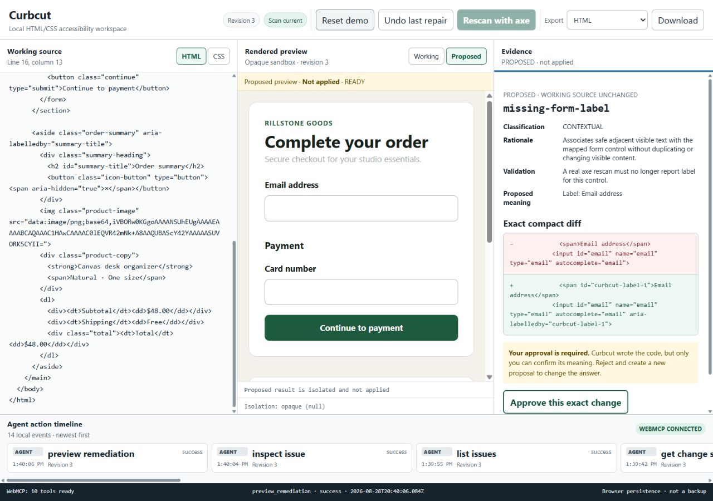
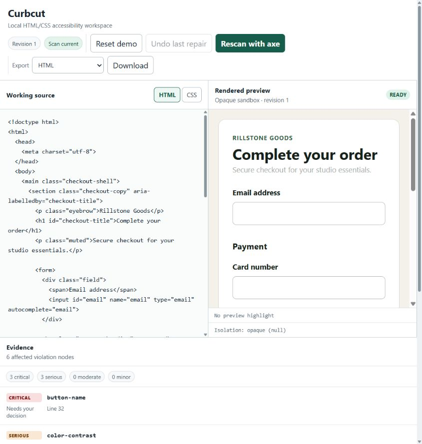

# Curbcut — Devpost submission draft

Status: production release candidate verified; owner video upload and Devpost submission remain pending.

## Submission fields

**Project name:** Curbcut

**Tagline:** A browser-native accessibility repair workbench where a developer and browser agent safely repair the same live HTML/CSS artifact.

**Live application:** <https://curbcut-one.vercel.app> — application commit `7a95ee9`, Vercel deployment `dpl_2S1fKA8yaBpWLnYjZaaYkuDZgf8Y`.

**Public repository:** <https://github.com/nbobby07/curbcut>

**License:** MIT — `LICENSE` is at the repository root.

**Demo video:** TODO — add the final public YouTube URL after the narrated video is uploaded and verified from a signed-out browser.

## Ready-to-paste project description

> **axe finds the evidence. Curbcut maps and patches it. Humans decide meaning.**

### The problem

Accessibility scanners are good at finding many mechanical failures, but a finding is only the beginning. A developer still has to connect a rendered DOM node to the right source range, understand the evidence, choose a defensible remediation, review how it changes the interface, verify the result, and avoid treating automated output as proof of compliance.

Curbcut turns that handoff into one visible, reversible workspace.

### What Curbcut does

Curbcut is a local-first workbench for editable static HTML and CSS. It keeps source, a securely rendered preview, factual axe-core findings, mapped source evidence, a proposed code diff, a proposed visual result, calibrated human/agent authority, verification results, exact Undo, export, and an agent-action timeline in one browser tab.

The built-in checkout fixture contains deterministic accessibility failures. A developer can also edit the source directly. axe runs against the real isolated preview rather than a stored result. Selecting an issue focuses its exact source range and highlights the corresponding rendered element. Every remediation first enters a visible, non-mutating proposed state. After that exact proposed iframe reports `READY`, a mechanical patch can apply directly; a contextual patch remains blocked until the developer supplies meaning and approves the exact diff. A real rescan verifies whether the intended axe finding disappeared, and Undo restores the exact prior source.

The current source ships five bounded repair families. Positive `tabindex` is mechanical. Form labels, image alternatives, button accessible names, and document language are contextual: their patch shapes are deterministic, but their meaning is human-confirmed and exact-diff approval-gated. A label proposal can associate safe adjacent visible text by adding a collision-free ID when needed plus `aria-labelledby`, avoiding a duplicate visible label. Image purpose/alternative text, button purpose, and document language remain human decisions. Other findings, including contrast, remain visible evidence/manual-review work rather than being silently “fixed.”

### Why WebMCP is the right interface

The core interaction is not “send code to an AI and accept a rewrite.” Curbcut exposes ten narrow WebMCP tools that correspond to real product actions: read workspace state, scan, list, inspect, preview, apply, reject, undo, summarize, and export. These tools call the same React store and secure preview bridge used by the visible controls.

That shared boundary materially improves the experience. The browser agent can perform repetitive multi-step work against the exact artifact the developer is looking at, while every call produces a visible UI side effect and a bounded structured result. Issue IDs, source revisions, proposal IDs, classifications, and allowed next actions keep the workflow stateful instead of relying on prose. Imported snippets are marked untrusted, source is never exposed through an arbitrary execution tool, and tool calls cannot manufacture semantic approval.

### What the human and agent can do together

The agent can run and filter scans, inspect evidence, synchronize source and preview focus, prepare a small deterministic proposal, apply an exact mechanical proposal, rescan, undo when asked, and summarize/export the result. The developer can see all the evidence the agent used, supply semantic meaning, compare working and proposed renders, inspect the exact diff, and approve or reject contextual changes.

This makes a workflow that is awkward across a scanner, editor, preview, and general coding agent happen in one live browser workspace. The agent handles mechanical work; the human retains authority where a repair invents meaning or changes design.

### How it was built

Curbcut is a browser-only React 19, TypeScript, and Vite application deployed as a static site on Vercel. It has no login, database, or application backend.

parse5 8.0.1 parses canonical HTML with source locations and assigns revision-bound internal node IDs. Curbcut injects mapping metadata only into generated preview markup, so exported source remains clean. Deterministic remediations use validated raw-offset patches that preserve unrelated bytes.

Untrusted HTML is sanitized with DOMPurify and rendered into an iframe with `sandbox="allow-scripts"` but no same-origin permission. A nonce-based CSP blocks network access, navigation, forms, embeds, and untrusted scripts. axe-core 4.13.0 executes inside that opaque preview realm. A secret-channel, request-ID, source-revision `postMessage` protocol carries validated render, scan, and highlight commands back to the React store.

The top document registers exactly ten imperative WebMCP tools. Inputs are runtime-validated, responses are bounded, read-only and untrusted-content annotations are applied, stale revisions are rejected, and cancellation is handled. Every new proposal first reports its proposed iframe as `RENDERING`; `get_workspace` must report that exact proposal `READY` before Apply is exposed. Mechanical proposals can then proceed without semantic approval, while contextual proposals additionally require an approval token created only by the visible UI.

### Responsible scope

Curbcut does not claim automated WCAG compliance. axe-core covers only part of accessibility, and several issues require context, design review, assistive-technology testing, and disabled-user expertise. The MVP supports one static HTML/CSS artifact and deliberately excludes JavaScript, executable embeds, framework projects, arbitrary URL scanning, whole-document model rewrites, and automatic contrast changes.

### Evidence

The frozen source gate passes 86/86 Vitest checks across nine files, 26/26 Playwright checks, and a validated WebMCP corpus of 36 trajectory cases across twelve intents and all ten tools. Coverage includes all five repair families, proposal-readiness and concurrent-mutation guards, reliable pristine-demo reset/persistence, the real offscreen mobile iframe/requestAnimationFrame scan regression and zero horizontal overflow, direct mechanical Apply, contextual approval, non-mutating rejection, the opaque-origin boundary, CSP/network/script isolation, parse5-to-DOM mapping, real axe scans, WebMCP registration and state effects, Apply/rescan, Undo/rescan, local import, canonical export, reload, a self-scan of Curbcut's own UI, and exact agreement between registered tool schemas and the eval snapshot.

Native Chrome through Chrome DevTools MCP 1.8 passed the production ten-tool workflow, including reload rediscovery, with zero console errors. The Codex in-app browser independently passed the updated production scan, `impact:"high"` listing, and mapped inspect calls with source selection, preview highlight, timeline activity, and zero console errors on August 28, 2026. Production response headers passed for CSP, `Permissions-Policy: tools=(self)`, Origin-Agent-Cluster, no-referrer, nosniff, and HSTS. Impeccable review returned **SHIP** and the release code audit returned **CLEAR**.

Curbcut is not keyed to its checkout fixture. A Playwright regression imports an unrelated local profile form and stylesheet, runs axe in the same opaque preview, and receives exactly the dynamic `label` and `tabindex` findings.

The OpenAI `gpt-5.4-mini-2026-03-17` trajectory run completed 72 tests with 214/253 strict passing rows (84.6%), 59/72 exact trajectories, 69/72 operationally correct trajectories after separating harmless extra bounded state/verification reads, and zero errors. The three genuine misses were two malformed copied issue IDs and one wrong rejection reason; no contextual approval boundary was bypassed. The key was ephemeral and is not a runtime dependency. Known non-blockers are the roughly 307.06 KB gzip Vite chunk warning (axe-core dominates) and scan-cap lower-bound semantics: capped results say `≥` and cannot falsely mark Apply or Undo verified.

## Production screenshots

## Judge testing instructions

1. Open <https://curbcut-one.vercel.app> in ChatGPT's in-app browser or a WebMCP-enabled Chrome build. The release candidate was verified in the Codex in-app browser on August 28, 2026 and in native Chrome through Chrome DevTools MCP 1.8.
2. Choose **Reset demo** if needed.
3. Send this prompt to the browser agent:

   > Fix the critical and serious accessibility issues in this checkout without changing the overall visual design. Preview each change before applying it, and ask me about anything that requires semantic judgment.

4. Confirm that scan/list/inspect calls populate the visible issue list, focus an exact source range, highlight the same rendered node, and appear in the local timeline.
5. Confirm the mechanical `tabindex` proposal is visible, reports `RENDERING`, becomes `READY` through `get_workspace`, then applies without a redundant semantic-approval click and clears after rescan.
6. For a label or image proposal, supply semantic text only if you agree with it. Review the working/proposed renders and exact diff, then choose **Approve this exact change**.
7. Confirm the intended finding disappears. Ask: **Undo the last repair and rescan.** Confirm exact source and the original finding return.
8. Ask: **Summarize the current changes and export the HTML.** Confirm a local canonical-source download with no Curbcut mapping attribute.

## Media checklist

- [ ] Upload a narrated video shorter than three minutes to YouTube with public visibility.
- [ ] Verify the video and audio from a signed-out browser.
- [ ] Show real tool discovery/calls, not a simulated invocation.
- [ ] Show scan evidence, synchronized source/preview focus, direct mechanical Apply, contextual visible approval, rescan, semantic review, and summary/export or Undo.
- [x] Recapture the scanned workspace from the frozen production deployment.
- [x] Recapture the mechanical diff and `RENDERING → READY → Apply` state from the frozen production deployment.
- [x] Recapture the contextual proposed diff/render/approval state from the frozen production deployment.
- [x] Recapture a distinct verified-result/timeline image from the frozen production deployment.
- [ ] Use narration only or properly licensed audio; do not add third-party trademarks or copyrighted music.

## Owner task — practitioner review (not submission evidence until completed)

- Recruit one frontend developer and one accessibility practitioner. Give each the production URL and core prompt without coaching.
- Ask each person to scan, inspect, explain the mechanical/contextual distinction, approve one contextual change, Undo, export, and import the profile fixture.
- Record role, browser/client, task completion or blocker, time to first verified repair, confusing wording, trust concerns, and any concrete defect found.
- Ask: “Would you trust this agent boundary?”, “Where did you need more evidence?”, and “Did anything imply compliance?”
- Publish only completed observations or consented quotes. Remove this section from the pasted submission if the sessions are not completed.

## Final submission checklist

- [ ] Join/registration status is confirmed in the submitting Devpost account.
- [x] Frozen current-source build is live in a clean target-client session and remains available without payment or credentials.
- [x] GitHub repository is public; root license is detected; About description and homepage are set.
- [x] `npm test` (86/86), all 26 Playwright checks, `npm run build`, and the measured 72-run OpenAI WebMCP corpus are complete with documented results.
- [ ] Final client, prompt, limitations, and measured evidence agree across README, reports, video, and Devpost text after the video is recorded.
- [ ] Every public screenshot and the final video depict the frozen deployment; screenshots pass, video remains pending.
- [ ] All URLs work from a signed-out browser.
- [ ] Submit before September 3, 2026 at 1:00 PM PT; use deadline morning only as recovery buffer.
